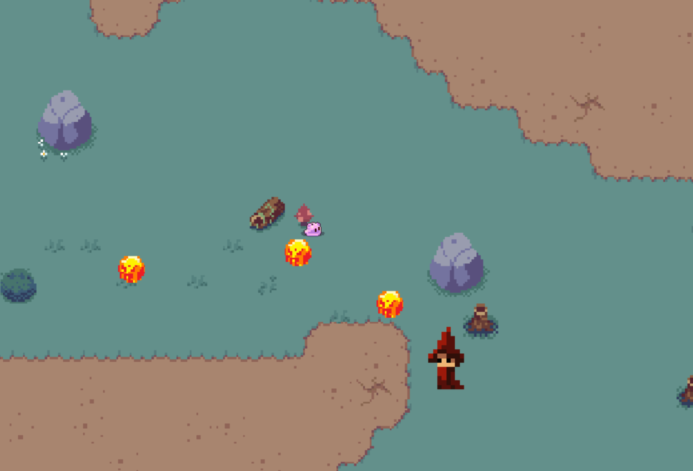

# Sleepy Slime - A Visual Computing Project
A little game written in C++

You play a little slime, which needs to dodge fire-balls thrown by a wizard.

Try to hide behind objects, beware that they wont hold out much though

- use "W","A","S","D" to move, "Enter" to activate a selected menu item.

- press 1 or 2 to select a level (more might be added)

## Art by:

### Menu: 
Fironell
 

### Pixel-Art:
slime: Chiecola https://chiecola.itch.io/
 
tiles and obstacles: PixiVan https://pixivan.itch.io/